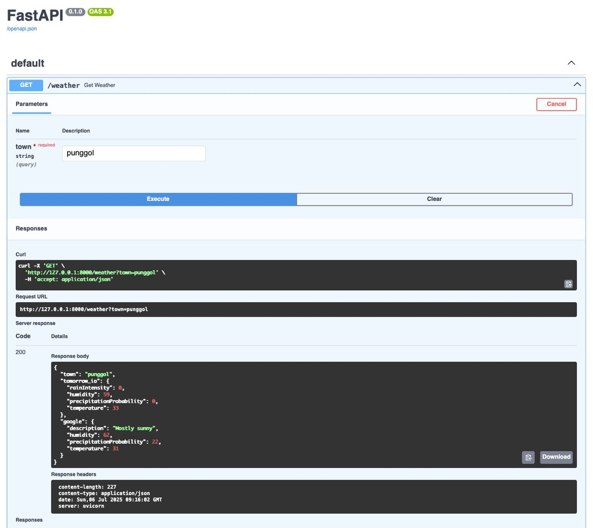

# sh-nami

<div align="center">
  
</div>

A lightweight weather aggregation API that combines forecasts from multiple sources to help users decide whether to head out or stay in. Built with FastAPI and designed specifically for Singapore locations.

## Features

- **Multi-Source Weather Data**: Aggregates weather information from both Tomorrow.io and Google Weather APIs
- **Singapore-Focused**: Comprehensive coverage of Singapore towns and locations
- **Fast & Lightweight**: Built with FastAPI for high performance and async support
- **Type-Safe**: Full Pydantic model validation for request/response handling
- **Offline Geocoding**: Pre-computed coordinates which allows for custom locations

## Tech Stack

- **Framework**: `FastAPI`
- **Data Validation**: `pydantic` v2
- **HTTP Client**: `httpx` for async requests
- **Package Management**: `poetry`
- **Python**: 3.13

## API Usage

### Get Weather Data

```http
GET /weather?town=bugis
```

**Response:**
```json
{
  "town": "bugis",
  "tomorrow_io": {
    "rainIntensity": 0.0,
    "humidity": 75.2,
    "precipitationProbability": 15.0,
    "temperature": 28.5
  },
  "google": {
    "description": "Partly cloudy",
    "humidity": 75.0,
    "precipitationProbability": 20.0,
    "temperature": 28.0
  }
}
```

### Supported Towns

The API supports all major Singapore towns including:
- Bugis, Orchard, Marina Bay, Tampines, Bedok, Jurong, Woodlands, Sengkang, Punggol, and many more...

## Coordinate Generation

Shoutout to `OpenStreetMap`'s `Nominatim` service for generation of coordinates for Singapore towns.

## Design Decisions

### Why Offline Geocoding?

1. **Reliability**: Avoids external API dependencies during runtime
2. **Custom Locations**: Support for specific Singapore locations not in generic geocoding services

### Multi-Source Weather Data

- **Tomorrow.io**: Provides detailed weather metrics (rain intensity, humidity, etc.)
- **Google Weather**: Offers weather descriptions and additional context

(_I do intend to add more in time to come..._)

## Development

### Project Structure

- **Models**: Pydantic models for type safety and validation
- **Services**: Business logic separated from API handlers
- **Helpers**: Utility functions for data processing
- **Data**: Local JSON storage for geographic data

### Key Components

- **WeatherService**: Orchestrates API calls to multiple weather providers
- **GeoService**: Handles town-to-coordinate lookups
- **ResponseHandler**: Parses and validates API responses
- **Models**: Define data structures and validation rules

## Data Sources

- **Tomorrow.io API**: Real-time weather data
- **Google Weather API**: Current weather conditions
- **OpenStreetMap Nominatim**: Geographic coordinate generation
- **Singapore Towns Dataset**: [Comprehensive list of Singapore locations](https://www.worldcitydb.com/singapore_in_singapore_state)

## License

This project is licensed under the MIT License - see the [LICENSE](LICENSE) file for details.
